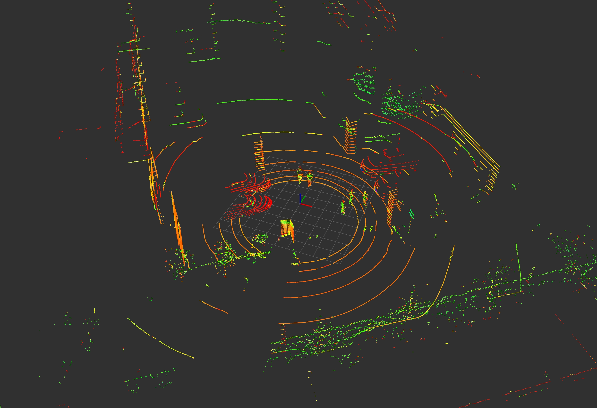

# Point Cloud Format Converter

## Support Format

### Input

- .bin


### Output

- .pcd


## Demo

Convert the **2024-06-25_11-19-36.bin** in this repo to **output_2024-08-23.pcd** following the guide below. After that, you can use `rviz` to visulize the point cloud as below:

```bash
rosrun pcl_ros pcd_to_pointcloud output_2024-08-23.pcd _frame_id:=laser _interval:=0.1 /cloud_pcd:=/point_cloud_raw
```

`/point_cloud_raw` would be the topic that contains point clouds. Now you can use the following rviz config to view the point cloud.


```
rosrun rviz rviz -d configs/view_point_cloud.rviz
```




## How to Use

### bin to pcd converter

```Python
python bin_to_pcd.py --input_bin ./2024-06-25_11-19-36.bin
```

The output pcd file will save in this directory as default. If you want to save the output pcd file to other directory, just add a parameter to the above command, something like `--output_pcd /home/user/Downloads`.


